# ResourceMindAI

ResourceMindAI is a web-based project and resource management application for
Admin, Manager, and Resource users. It combines deterministic business rules
with configurable LLM-assisted resource matching and project risk summaries.

The solution uses:

- Angular with Kendo UI components and Signals
- ASP.NET Core Web API
- Entity Framework Core with SQL Server
- JWT bearer authentication
- Gemini or Gemma structured JSON responses through a provider factory
- Global exception handling and role-based authorization

## Contents

1. [Class diagrams](#class-diagrams)
2. [Use case diagrams](#use-case-diagrams)
3. [Sequence diagrams](#sequence-diagrams)
4. [Entity relationship diagram](#entity-relationship-diagram)
5. [Current API surface](#current-api-surface)
6. [Business rules](#business-rules)
7. [LLM provider configuration](#llm-provider-configuration)
8. [Project health email notifications](#project-health-email-notifications)
9. [Automated backend tests](#automated-backend-tests)


## Class diagrams

### Domain model

All primary keys and foreign keys use `Guid`.

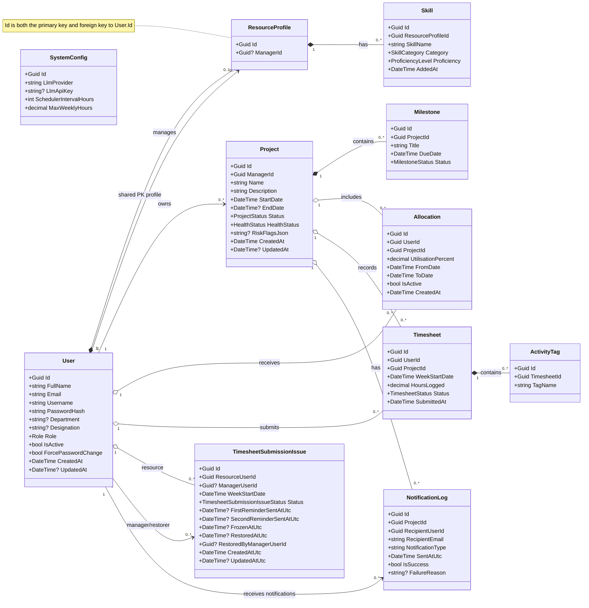
```mermaid
classDiagram
    direction LR

    class User {
        +Guid Id
        +string FullName
        +string Email
        +string Username
        +string PasswordHash
        +string? Department
        +string? Designation
        +Role Role
        +bool IsActive
        +bool ForcePasswordChange
        +DateTime CreatedAt
        +DateTime? UpdatedAt
    }

    class ResourceProfile {
        +Guid Id
        +Guid? ManagerId
    }

    note for ResourceProfile "Id is both the primary key and foreign key to User.Id"

    class Skill {
        +Guid Id
        +Guid ResourceProfileId
        +string SkillName
        +SkillCategory Category
        +ProficiencyLevel Proficiency
        +DateTime AddedAt
    }

    class Project {
        +Guid Id
        +Guid ManagerId
        +string Name
        +string Description
        +DateTime StartDate
        +DateTime? EndDate
        +ProjectStatus Status
        +HealthStatus HealthStatus
        +string? RiskFlagsJson
        +DateTime CreatedAt
        +DateTime? UpdatedAt
    }

    class Milestone {
        +Guid Id
        +Guid ProjectId
        +string Title
        +DateTime DueDate
        +MilestoneStatus Status
    }

    class Allocation {
        +Guid Id
        +Guid UserId
        +Guid ProjectId
        +decimal UtilisationPercent
        +DateTime FromDate
        +DateTime ToDate
        +bool IsActive
        +DateTime CreatedAt
    }

    class Timesheet {
        +Guid Id
        +Guid UserId
        +Guid ProjectId
        +DateTime WeekStartDate
        +decimal HoursLogged
        +TimesheetStatus Status
        +DateTime SubmittedAt
    }

    class ActivityTag {
        +Guid Id
        +Guid TimesheetId
        +string TagName
    }

    class TimesheetSubmissionIssue {
        +Guid Id
        +Guid ResourceUserId
        +Guid? ManagerUserId
        +DateTime WeekStartDate
        +TimesheetSubmissionIssueStatus Status
        +DateTime? FirstReminderSentAtUtc
        +DateTime? SecondReminderSentAtUtc
        +DateTime? FrozenAtUtc
        +DateTime? RestoredAtUtc
        +Guid? RestoredByManagerUserId
        +DateTime CreatedAtUtc
        +DateTime? UpdatedAtUtc
    }

    class NotificationLog {
        +Guid Id
        +Guid ProjectId
        +Guid RecipientUserId
        +string RecipientEmail
        +string NotificationType
        +DateTime SentAtUtc
        +bool IsSuccess
        +string? FailureReason
    }

    class SystemConfig {
        +Guid Id
        +string LlmProvider
        +string? LlmApiKey
        +int SchedulerIntervalHours
        +decimal MaxWeeklyHours
    }

    User "1" *-- "0..1" ResourceProfile : shared PK profile
    User "1" --> "0..*" ResourceProfile : manages
    User "1" --> "0..*" Project : owns
    User "1" o-- "0..*" Allocation : receives
    User "1" o-- "0..*" Timesheet : submits
    User "1" o-- "0..*" TimesheetSubmissionIssue : resource
    User "1" --> "0..*" TimesheetSubmissionIssue : manager/restorer
    User "1" --> "0..*" NotificationLog : receives notifications
    ResourceProfile "1" *-- "0..*" Skill : has
    Project "1" *-- "0..*" Milestone : contains
    Project "1" o-- "0..*" Allocation : includes
    Project "1" o-- "0..*" Timesheet : records
    Project "1" o-- "0..*" NotificationLog : has
    Timesheet "1" *-- "0..*" ActivityTag : contains
```

### Application and infrastructure services


```mermaid
classDiagram
    direction TB

    class IAuthService {
        <<interface>>
        +LoginAsync(LoginDto)
        +ChangePasswordAsync(ChangePasswordDto)
    }

    class IUserService {
        <<interface>>
        +GetAllAsync()
        +GetActiveManagersAsync()
        +CreateAsync(CreateUserDto)
        +ResetPasswordAsync(userId)
        +DeactivateAsync(userId)
        +ReactivateAsync(userId)
    }

    class IAdminEmployeeService {
        <<interface>>
        +GetAllAsync()
        +GetSkillsAsync(employeeId)
        +AddSkillAsync(employeeId, request)
        +UpdateSkillProficiencyAsync(employeeId, skillId, request)
        +GetManagerUpdatePreviewAsync(employeeId, managerId)
        +UpdateManagerAsync(employeeId, request)
    }

    class IProjectService {
        <<interface>>
        +GetAllAsync()
        +CreateAsync(request)
        +GetMilestonesAsync(projectId)
        +AddMilestoneAsync(projectId, request)
        +UpdateMilestoneAsync(projectId, milestoneId, request)
        +UpdateManagerAsync(projectId, request)
    }

    class IManagerService {
        <<interface>>
        +GetResourceDashboardAsync(managerId)
        +GetResourceDetailAsync(managerId, resourceId)
        +GetProjectsAsync(managerId)
        +GetProjectDetailAsync(managerId, projectId)
        +GetSubmittedTimesheetsAsync(managerId)
        +FindResourcesAsync(managerId, request)
        +AllocateAsync(managerId, request)
        +EndAllocationAsync(managerId, allocationId)
        +GenerateProjectRiskSummaryAsync(managerId, projectId)
        +GenerateScheduledProjectRiskSummaryAsync(managerId, projectId)
    }

    class ITimesheetService {
        <<interface>>
        +GetAllocationsAsync(userId)
        +GetWeekAsync(userId, week)
        +SubmitAsync(userId, request)
        +GetHistoryAsync(userId)
        +GetWeekDetailAsync(userId, week)
    }

    class ITimesheetSubmissionEscalationService {
        <<interface>>
        +ProcessAsync(utcNow)
        +RestoreAccessAsync(managerUserId, resourceUserId, weekStartDate)
        +GetFrozenAsync(managerUserId)
    }

    class ITimesheetSubmissionNotificationService {
        <<interface>>
        +SendFirstReminderAsync(resource, weekStartDate)
        +SendSecondReminderAsync(resource, weekStartDate)
        +SendFrozenEscalationAsync(resource, manager, weekStartDate)
    }

    class TimesheetSubmissionEscalationService {
        +ProcessAsync(utcNow)
        +RestoreAccessAsync(managerUserId, resourceUserId, weekStartDate)
        +GetFrozenAsync(managerUserId)
    }

    class TimesheetSubmissionNotificationService {
        +SendFirstReminderAsync(resource, weekStartDate)
        +SendSecondReminderAsync(resource, weekStartDate)
        +SendFrozenEscalationAsync(resource, manager, weekStartDate)
    }

    class IProjectHealthReportProcessor {
        <<interface>>
        +ProcessAsync()
    }

    class IProjectHealthEmailProcessor {
        <<interface>>
        +ProcessAsync()
    }

    class IProjectHealthNotificationService {
        <<interface>>
        +NotifyAsync(request)
    }

    class ISchedulerComputationService {
        <<interface>>
        +ExecuteAsync()
    }

    class ProjectHealthReportProcessor {
        +ProcessAsync()
    }

    class ProjectHealthEmailProcessor {
        +ProcessAsync()
    }

    class ProjectHealthNotificationService {
        +NotifyAsync(request)
    }

    class SchedulerComputationService {
        +ExecuteAsync()
    }

    class IEmailService {
        <<interface>>
        +SendAsync(message)
    }

    class BrevoEmailService {
        +SendAsync(message)
    }

    class BackgroundServices {
        ResourceSchedulerService
        ProjectHealthSchedulerService
        ProjectHealthEmailSchedulerService
        TimesheetSubmissionReminderScheduler
    }

    class ILlmClient {
        <<interface>>
        +ExtractResourceIntentAsync(requirement)
        +ExplainResourceMatchesAsync(request)
        +BuildTeamAsync(request)
        +GenerateProjectRiskSummaryAsync(facts)
    }

    class ConfiguredLlmClient
    class ILlmClientFactory
    class LlmClientFactory
    class ILlmProviderClient
    class GeminiClient
    class GemmaClient
    class PromptBuilder
    class Repositories {
        IUserRepository
        IAdminEmployeeRepository
        IProjectRepository
        IManagerRepository
        IAllocationRepository
        ITimesheetRepository
        ITimesheetSubmissionIssueRepository
        ISystemConfigRepository
        ISchedulerRepository
        INotificationLogRepository
    }

    IAuthService --> Repositories
    IUserService --> Repositories
    IAdminEmployeeService --> Repositories
    IProjectService --> Repositories
    IManagerService --> Repositories
    ITimesheetService --> Repositories : checks frozen state
    ITimesheetSubmissionEscalationService <|.. TimesheetSubmissionEscalationService
    TimesheetSubmissionEscalationService --> Repositories
    TimesheetSubmissionEscalationService --> ITimesheetSubmissionNotificationService
    ITimesheetSubmissionNotificationService <|.. TimesheetSubmissionNotificationService
    TimesheetSubmissionNotificationService --> IEmailService
    IProjectHealthReportProcessor <|.. ProjectHealthReportProcessor
    IProjectHealthEmailProcessor <|.. ProjectHealthEmailProcessor
    IProjectHealthNotificationService <|.. ProjectHealthNotificationService
    ISchedulerComputationService <|.. SchedulerComputationService
    ProjectHealthReportProcessor --> Repositories
    ProjectHealthReportProcessor --> IManagerService
    ProjectHealthEmailProcessor --> Repositories
    ProjectHealthEmailProcessor --> IProjectHealthNotificationService
    ProjectHealthNotificationService --> IEmailService
    ProjectHealthNotificationService --> Repositories
    SchedulerComputationService --> Repositories
    IEmailService <|.. BrevoEmailService
    BackgroundServices --> IProjectHealthReportProcessor
    BackgroundServices --> IProjectHealthEmailProcessor
    BackgroundServices --> ITimesheetSubmissionEscalationService
    BackgroundServices --> ISchedulerComputationService
    BackgroundServices --> Repositories
    IManagerService --> ILlmClient
    ILlmClient <|.. ConfiguredLlmClient
    ConfiguredLlmClient --> ILlmClientFactory
    ILlmClientFactory <|.. LlmClientFactory
    LlmClientFactory --> ILlmProviderClient
    ILlmProviderClient <|.. GeminiClient
    ILlmProviderClient <|.. GemmaClient
    GeminiClient --> PromptBuilder
    GemmaClient --> PromptBuilder
```

### Controller and authorization map

```mermaid
classDiagram
    direction LR

    class AuthController {
        +POST login
        +POST change-password
    }
    class UserController {
        +GET users
        +POST user
        +PATCH deactivate
        +PATCH reactivate
        +POST reset-password
    }
    class AdminEmployeeController {
        +GET employees
        +GET skills
        +POST skill
        +PATCH proficiency
        +GET manager-update-preview
        +PATCH manager
    }
    class ProjectController {
        +GET projects
        +POST project
        +GET milestones
        +POST milestone
        +PUT milestone
        +PATCH manager
    }
    class ManagerController {
        +GET resources
        +GET resources/{resourceId}
        +POST resources-find
        +GET projects
        +GET projects/{projectId}
        +POST risk-summary
        +POST allocation
        +PATCH end-allocation
        +GET timesheets
        +GET timesheets/frozen
        +PATCH restore-timesheet-access
    }
    class ResourceController {
        +GET allocations
        +GET timesheet-week
        +POST timesheet
        +GET timesheets
        +GET timesheet-detail
    }

    AuthController --> IAuthService
    UserController --> IUserService
    AdminEmployeeController --> IAdminEmployeeService
    ProjectController --> IProjectService
    ManagerController --> IManagerService
    ManagerController --> ITimesheetSubmissionEscalationService
    ResourceController --> ITimesheetService
```

## Use case diagrams

Mermaid does not provide a native UML use-case shape, so these diagrams use
flowcharts with actors outside the system boundary, use cases inside the
boundary, solid association lines, and dashed dependency arrows.

UML use-case rules used here:

* `<<include>>` = required shared behavior
* `<<extend>>` = optional or conditional behavior
* There is no standard UML `<<exclude>>` relationship

## Use case diagrams

Mermaid does not provide a native UML use-case shape, so these diagrams use
flowcharts with actors outside the system boundary, use cases inside the
boundary, solid association lines, and dashed dependency arrows labeled
`include` or `extend`. UML use-case diagrams use `include` for required shared
behavior and `extend` for optional or conditional behavior; there is no
standard `exclude` relationship.

### Admin use cases

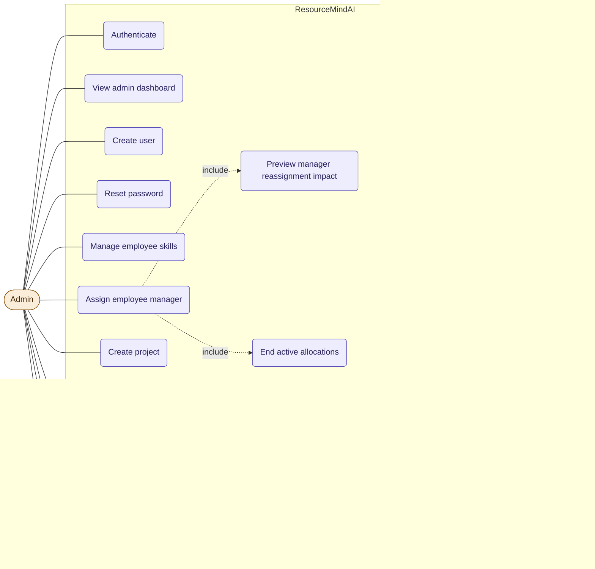
```mermaid
flowchart LR
    Admin(["Admin"])

    subgraph System["ResourceMindAI"]
        UC_Auth("Authenticate")
        UC_Dashboard("View admin dashboard")
        UC_CreateUser("Create user")
        UC_UserStatus("Manage user status")
        UC_ResetPassword("Reset password")
        UC_Skills("Manage employee skills")
        UC_AssignManager("Assign employee manager")
        UC_ManagerPreview("Preview manager reassignment impact")
        UC_EndAllocations("End active allocations")
        UC_CreateProject("Create project")
        UC_Milestones("Manage milestones")
        UC_ProjectManager("Update project manager")
        UC_ManagerConflict("Validate manager ownership conflicts")
        UC_AllAllocations("View all allocations")
    end

    Admin --- UC_Auth
    Admin --- UC_Dashboard
    Admin --- UC_CreateUser
    Admin --- UC_UserStatus
    Admin --- UC_ResetPassword
    Admin --- UC_Skills
    Admin --- UC_AssignManager
    Admin --- UC_CreateProject
    Admin --- UC_Milestones
    Admin --- UC_ProjectManager
    Admin --- UC_AllAllocations

    UC_AssignManager -.include.-> UC_ManagerPreview
    UC_AssignManager -.include.-> UC_EndAllocations
    UC_ProjectManager -.include.-> UC_ManagerConflict
    UC_ManagerConflict -.extend: manager deactivation.-> UC_UserStatus

    classDef actor fill:#FAEEDA,stroke:#854F0B,stroke-width:1px,color:#412402
    classDef usecase fill:#EEEDFE,stroke:#534AB7,stroke-width:1px,color:#26215C
    class Admin actor
    class UC_Auth,UC_Dashboard,UC_CreateUser,UC_UserStatus,UC_ResetPassword,UC_Skills,UC_AssignManager,UC_ManagerPreview,UC_EndAllocations,UC_CreateProject,UC_Milestones,UC_ProjectManager,UC_ManagerConflict,UC_AllAllocations usecase
```

### Manager use cases

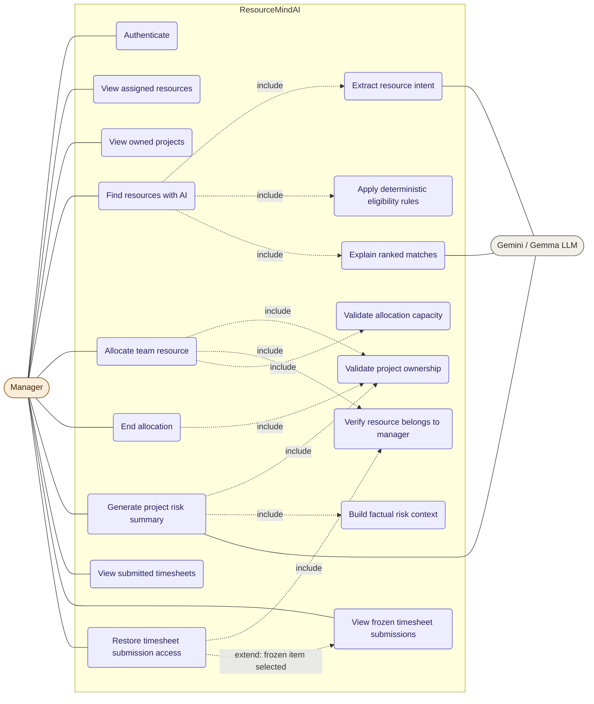
```mermaid
flowchart LR
    Manager(["Manager"])
    LLM(["Gemini / Gemma LLM"])

    subgraph System["ResourceMindAI"]
        UC_Auth("Authenticate")
        UC_Resources("View assigned resources")
        UC_Projects("View owned projects")
        UC_Find("Find resources with AI")
        UC_Intent("Extract resource intent")
        UC_Eligibility("Apply deterministic eligibility rules")
        UC_Explain("Explain ranked matches")
        UC_Allocate("Allocate team resource")
        UC_Ownership("Validate project ownership")
        UC_Capacity("Validate allocation capacity")
        UC_EndAllocation("End allocation")
        UC_Risk("Generate project risk summary")
        UC_RiskFacts("Build factual risk context")
        UC_Timesheets("View submitted timesheets")
        UC_Frozen("View frozen timesheet submissions")
        UC_Restore("Restore timesheet submission access")
        UC_VerifyResource("Verify resource belongs to manager")
    end

    Manager --- UC_Auth
    Manager --- UC_Resources
    Manager --- UC_Projects
    Manager --- UC_Find
    Manager --- UC_Allocate
    Manager --- UC_EndAllocation
    Manager --- UC_Risk
    Manager --- UC_Timesheets
    Manager --- UC_Frozen
    Manager --- UC_Restore

    UC_Find -.include.-> UC_Intent
    UC_Find -.include.-> UC_Eligibility
    UC_Find -.include.-> UC_Explain
    UC_Intent --- LLM
    UC_Explain --- LLM
    UC_Allocate -.include.-> UC_Ownership
    UC_Allocate -.include.-> UC_VerifyResource
    UC_Allocate -.include.-> UC_Capacity
    UC_EndAllocation -.include.-> UC_Ownership
    UC_Risk -.include.-> UC_Ownership
    UC_Risk -.include.-> UC_RiskFacts
    UC_Risk --- LLM
    UC_Restore -.include.-> UC_VerifyResource
    UC_Restore -.extend: frozen item selected.-> UC_Frozen

    classDef actor fill:#FAEEDA,stroke:#854F0B,stroke-width:1px,color:#412402
    classDef external fill:#F1EFE8,stroke:#5F5E5A,stroke-width:1px,color:#2C2C2A
    classDef usecase fill:#EEEDFE,stroke:#534AB7,stroke-width:1px,color:#26215C
    class Manager actor
    class LLM external
    class UC_Auth,UC_Resources,UC_Projects,UC_Find,UC_Intent,UC_Eligibility,UC_Explain,UC_Allocate,UC_Ownership,UC_Capacity,UC_EndAllocation,UC_Risk,UC_RiskFacts,UC_Timesheets,UC_Frozen,UC_Restore,UC_VerifyResource usecase
```

### Resource self-service use cases

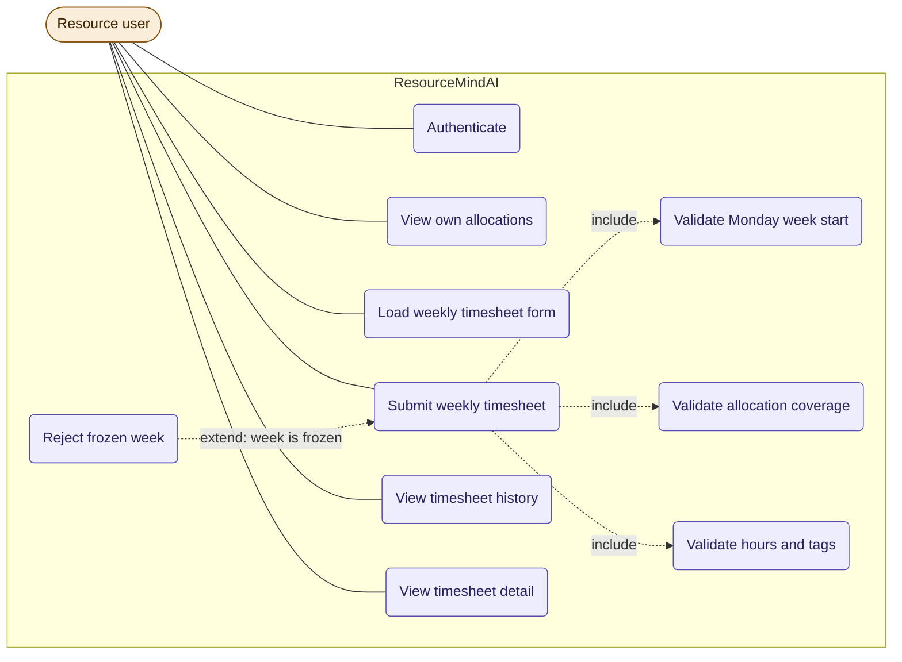
```mermaid
flowchart LR
    Resource(["Resource user"])

    subgraph System["ResourceMindAI"]
        UC_Auth("Authenticate")
        UC_Allocations("View own allocations")
        UC_LoadWeek("Load weekly timesheet form")
        UC_Submit("Submit weekly timesheet")
        UC_Monday("Validate Monday week start")
        UC_Coverage("Validate allocation coverage")
        UC_HoursTags("Validate hours and tags")
        UC_RejectFrozen("Reject frozen week")
        UC_History("View timesheet history")
        UC_Detail("View timesheet detail")
    end

    Resource --- UC_Auth
    Resource --- UC_Allocations
    Resource --- UC_LoadWeek
    Resource --- UC_Submit
    Resource --- UC_History
    Resource --- UC_Detail

    UC_Submit -.include.-> UC_Monday
    UC_Submit -.include.-> UC_Coverage
    UC_Submit -.include.-> UC_HoursTags
    UC_RejectFrozen -.extend: week is frozen.-> UC_Submit

    classDef actor fill:#FAEEDA,stroke:#854F0B,stroke-width:1px,color:#412402
    classDef usecase fill:#EEEDFE,stroke:#534AB7,stroke-width:1px,color:#26215C
    class Resource actor
    class UC_Auth,UC_Allocations,UC_LoadWeek,UC_Submit,UC_Monday,UC_Coverage,UC_HoursTags,UC_RejectFrozen,UC_History,UC_Detail usecase
```

### Scheduled automation use cases

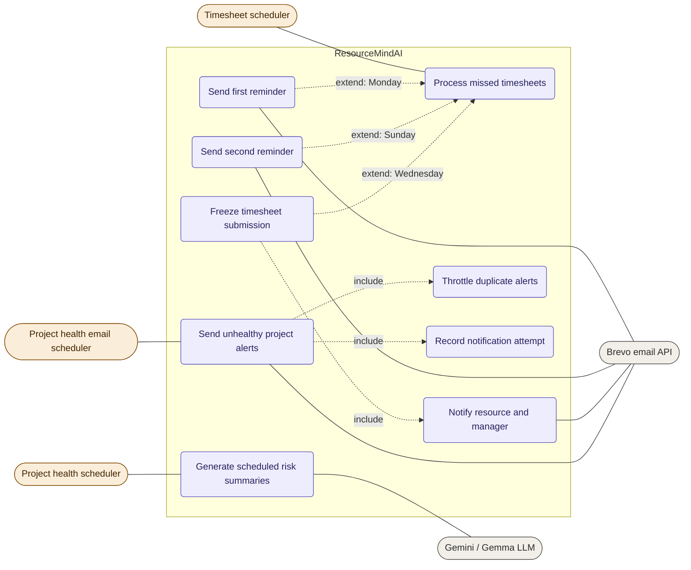
```mermaid
flowchart LR
    TimesheetScheduler(["Timesheet scheduler"])
    HealthScheduler(["Project health scheduler"])
    EmailScheduler(["Project health email scheduler"])
    Brevo(["Brevo email API"])
    LLM(["Gemini / Gemma LLM"])

    subgraph System["ResourceMindAI"]
        UC_ProcessMissed("Process missed timesheets")
        UC_FirstReminder("Send first reminder")
        UC_SecondReminder("Send second reminder")
        UC_Freeze("Freeze timesheet submission")
        UC_FreezeNotify("Notify resource and manager")

        UC_ScheduledRisk("Generate scheduled risk summaries")
        UC_HealthEmail("Send unhealthy project alerts")
        UC_Throttle("Throttle duplicate alerts")
        UC_LogNotification("Record notification attempt")
    end

    TimesheetScheduler --- UC_ProcessMissed
    UC_FirstReminder -.extend: Monday.-> UC_ProcessMissed
    UC_SecondReminder -.extend: Sunday.-> UC_ProcessMissed
    UC_Freeze -.extend: Wednesday.-> UC_ProcessMissed
    UC_Freeze -.include.-> UC_FreezeNotify
    UC_FirstReminder --- Brevo
    UC_SecondReminder --- Brevo
    UC_FreezeNotify --- Brevo

    HealthScheduler --- UC_ScheduledRisk
    UC_ScheduledRisk --- LLM
    EmailScheduler --- UC_HealthEmail
    UC_HealthEmail -.include.-> UC_Throttle
    UC_HealthEmail -.include.-> UC_LogNotification
    UC_HealthEmail --- Brevo

    classDef actor fill:#FAEEDA,stroke:#854F0B,stroke-width:1px,color:#412402
    classDef external fill:#F1EFE8,stroke:#5F5E5A,stroke-width:1px,color:#2C2C2A
    classDef usecase fill:#EEEDFE,stroke:#534AB7,stroke-width:1px,color:#26215C
    class TimesheetScheduler,HealthScheduler,EmailScheduler actor
    class Brevo,LLM external
    class UC_ProcessMissed,UC_FirstReminder,UC_SecondReminder,UC_Freeze,UC_FreezeNotify,UC_ScheduledRisk,UC_HealthEmail,UC_Throttle,UC_LogNotification usecase
```


## Sequence diagrams

## Authentication and authorization

- Login returns a JWT and user profile.
- The Angular application stores the JWT in `sessionStorage`.
- The HTTP interceptor adds `Authorization: Bearer <token>` to API requests.
- Each browser tab has independent session storage, which supports testing
  different roles in separate tabs.
- Angular route guards provide navigation control.
- ASP.NET Core role authorization is the authoritative security boundary.
- JWT validation verifies issuer, audience, signature, expiration, and active
  user state.
- New users receive an initial password equal to their username and must change
  it after first login.

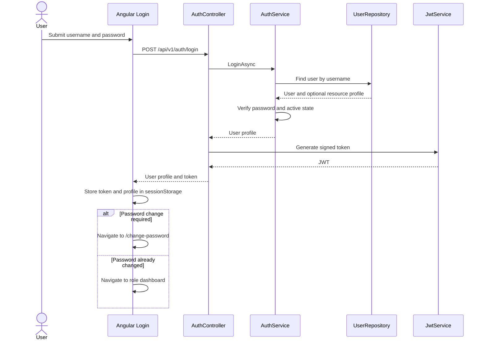
```mermaid
sequenceDiagram
    actor User
    participant UI as Angular Login
    participant Auth as AuthController
    participant Service as AuthService
    participant Repo as UserRepository
    participant JWT as JwtService

    User->>UI: Submit username and password
    UI->>Auth: POST /api/v1/auth/login
    Auth->>Service: LoginAsync
    Service->>Repo: Find user by username
    Repo-->>Service: User and optional resource profile
    Service->>Service: Verify password and active state
    Service-->>Auth: User profile
    Auth->>JWT: Generate signed token
    JWT-->>Auth: JWT
    Auth-->>UI: User profile and token
    UI->>UI: Store token and profile in sessionStorage

    alt Password change required
        UI->>UI: Navigate to /change-password
    else Password already changed
        UI->>UI: Navigate to role dashboard
    end
```

### Admin creates a user

User creation writes only the user account. Department, designation, role, and
active status belong to the user. A shared-key resource profile is created
later only when profile-specific data is required, such as resource manager
assignment or skills.

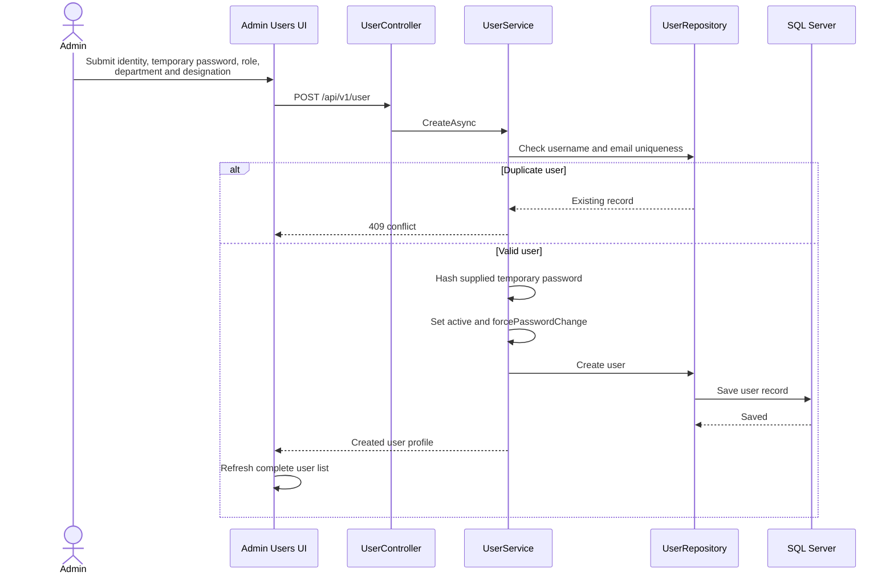
```mermaid
sequenceDiagram
    actor Admin
    participant UI as Admin Users UI
    participant API as UserController
    participant Service as UserService
    participant Repo as UserRepository
    participant DB as SQL Server

    Admin->>UI: Submit identity, temporary password, role,<br/>department and designation
    UI->>API: POST /api/v1/user
    API->>Service: CreateAsync
    Service->>Repo: Check username and email uniqueness

    alt Duplicate user
        Repo-->>Service: Existing record
        Service-->>UI: 409 conflict
    else Valid user
        Service->>Service: Hash supplied temporary password
        Service->>Service: Set active and forcePasswordChange
        Service->>Repo: Create user
        Repo->>DB: Save user record
        DB-->>Repo: Saved
        Service-->>UI: Created user profile
        UI->>UI: Refresh complete user list
    end
```

### Deactivate and reactivate user


```mermaid
sequenceDiagram
    actor Admin
    participant UI as Admin Users UI
    participant API as UserController
    participant Service as UserService
    participant Repo as UserRepository

    Admin->>UI: Select Deactivate
    UI->>API: PATCH /api/v1/user/{id}/deactivate
    API->>Service: DeactivateAsync

    alt Admin user
        Service->>Service: Set User.IsActive = false
    else Resource user
        Service->>Service: Set User.IsActive = false
        Service->>Service: End active allocations today
        Service->>Service: Clear ResourceProfile.ManagerId
    else Manager user
        Service->>Repo: Find active/planned projects and active subordinates
        alt Manager still owns work or resources
            Service-->>UI: Validation details with project and resource names
        else No dependencies
            Service->>Service: Set User.IsActive = false
        end
    end

    Service->>Repo: Save status change
    Repo-->>UI: Result

    opt Admin later selects Reactivate
        UI->>API: PATCH /api/v1/user/{id}/reactivate
        API->>Service: ReactivateAsync
        Service->>Service: Set User.IsActive = true
        Note over Service: Allocations and manager assignment are not restored
    end
```

### Update employee manager

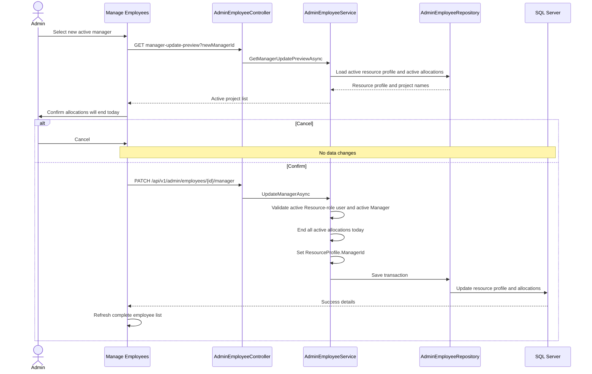
```mermaid
sequenceDiagram
    actor Admin
    participant UI as Manage Employees
    participant API as AdminEmployeeController
    participant Service as AdminEmployeeService
    participant Repo as AdminEmployeeRepository
    participant DB as SQL Server

    Admin->>UI: Select new active manager
    UI->>API: GET manager-update-preview?newManagerId
    API->>Service: GetManagerUpdatePreviewAsync
    Service->>Repo: Load active resource profile and active allocations
    Repo-->>Service: Resource profile and project names
    Service-->>UI: Active project list
    UI->>Admin: Confirm allocations will end today

    alt Cancel
        Admin->>UI: Cancel
        Note over UI,DB: No data changes
    else Confirm
        UI->>API: PATCH /api/v1/admin/employees/{id}/manager
        API->>Service: UpdateManagerAsync
        Service->>Service: Validate active Resource-role user and active Manager
        Service->>Service: End all active allocations today
        Service->>Service: Set ResourceProfile.ManagerId
        Service->>Repo: Save transaction
        Repo->>DB: Update resource profile and allocations
        DB-->>UI: Success details
        UI->>UI: Refresh complete employee list
    end
```

### Update project manager


```mermaid
sequenceDiagram
    actor Admin
    participant UI as Manage Projects
    participant API as ProjectController
    participant Service as ProjectService
    participant Repo as ProjectRepository
    participant DB as SQL Server

    Admin->>UI: Select new active manager
    UI->>API: PATCH /api/v1/project/{id}/manager
    API->>Service: UpdateManagerAsync
    Service->>Repo: Load project and active allocated resource profiles
    Service->>Repo: Find other active projects under current manager

    alt Resource has another active project under current manager
        Service-->>UI: Conflict details with resources and projects
        UI->>Admin: Show update-not-possible dialog
    else No conflicts
        Service->>Service: Update Project.ManagerId
        Service->>Service: Update allocated ResourceProfile.ManagerId values
        Service->>Repo: Save transaction
        Repo->>DB: Update project and resource profiles
        DB-->>UI: Success
        UI->>UI: Refresh project list
    end
```

### AI-assisted resource search

Resource eligibility remains deterministic. The configured LLM extracts intent and explains
only the candidates already approved by backend rules.

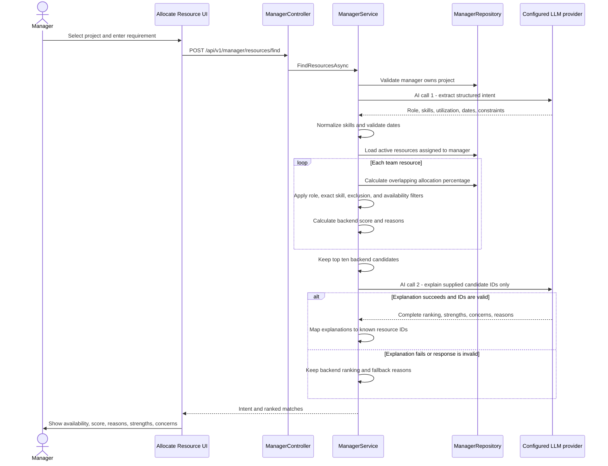
```mermaid
sequenceDiagram
    actor Manager
    participant UI as Allocate Resource UI
    participant API as ManagerController
    participant Service as ManagerService
    participant Repo as ManagerRepository
    participant LLM as Configured LLM provider

    Manager->>UI: Select project and enter requirement
    UI->>API: POST /api/v1/manager/resources/find
    API->>Service: FindResourcesAsync
    Service->>Repo: Validate manager owns project
    Service->>LLM: AI call 1 - extract structured intent
    LLM-->>Service: Role, skills, utilization, dates, constraints
    Service->>Service: Normalize skills and validate dates
    Service->>Repo: Load active resources assigned to manager

    loop Each team resource
        Service->>Repo: Calculate overlapping allocation percentage
        Service->>Service: Apply role, exact skill, exclusion, and availability filters
        Service->>Service: Calculate backend score and reasons
    end

    Service->>Service: Keep top ten backend candidates
    Service->>LLM: AI call 2 - explain supplied candidate IDs only

    alt Explanation succeeds and IDs are valid
        LLM-->>Service: Complete ranking, strengths, concerns, reasons
        Service->>Service: Map explanations to known resource IDs
    else Explanation fails or response is invalid
        Service->>Service: Keep backend ranking and fallback reasons
    end

    Service-->>UI: Intent and ranked matches
    UI->>Manager: Show availability, score, reasons, strengths, concerns
```

### Manager allocates or ends a resource allocation

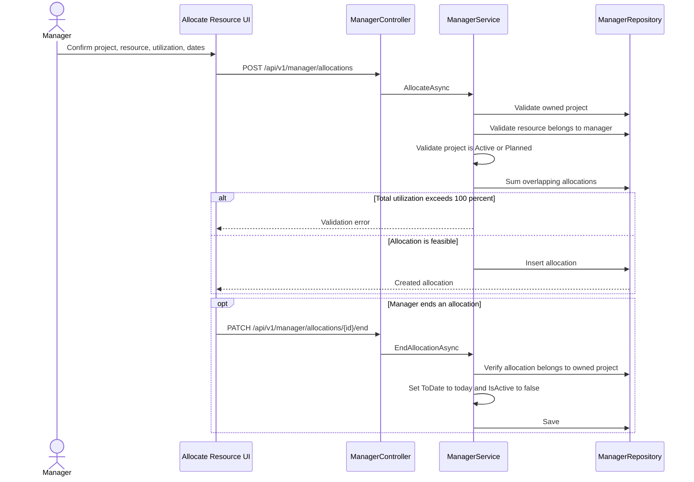
```mermaid
sequenceDiagram
    actor Manager
    participant UI as Allocate Resource UI
    participant API as ManagerController
    participant Service as ManagerService
    participant Repo as ManagerRepository

    Manager->>UI: Confirm project, resource, utilization, dates
    UI->>API: POST /api/v1/manager/allocations
    API->>Service: AllocateAsync
    Service->>Repo: Validate owned project
    Service->>Repo: Validate resource belongs to manager
    Service->>Service: Validate project is Active or Planned
    Service->>Repo: Sum overlapping allocations

    alt Total utilization exceeds 100 percent
        Service-->>UI: Validation error
    else Allocation is feasible
        Service->>Repo: Insert allocation
        Repo-->>UI: Created allocation
    end

    opt Manager ends an allocation
        UI->>API: PATCH /api/v1/manager/allocations/{id}/end
        API->>Service: EndAllocationAsync
        Service->>Repo: Verify allocation belongs to owned project
        Service->>Service: Set ToDate to today and IsActive to false
        Service->>Repo: Save
    end
```

### On-demand AI project risk summary

Opening project detail never calls Gemini. It reads the last valid JSON saved in
`Project.RiskFlagsJson`.

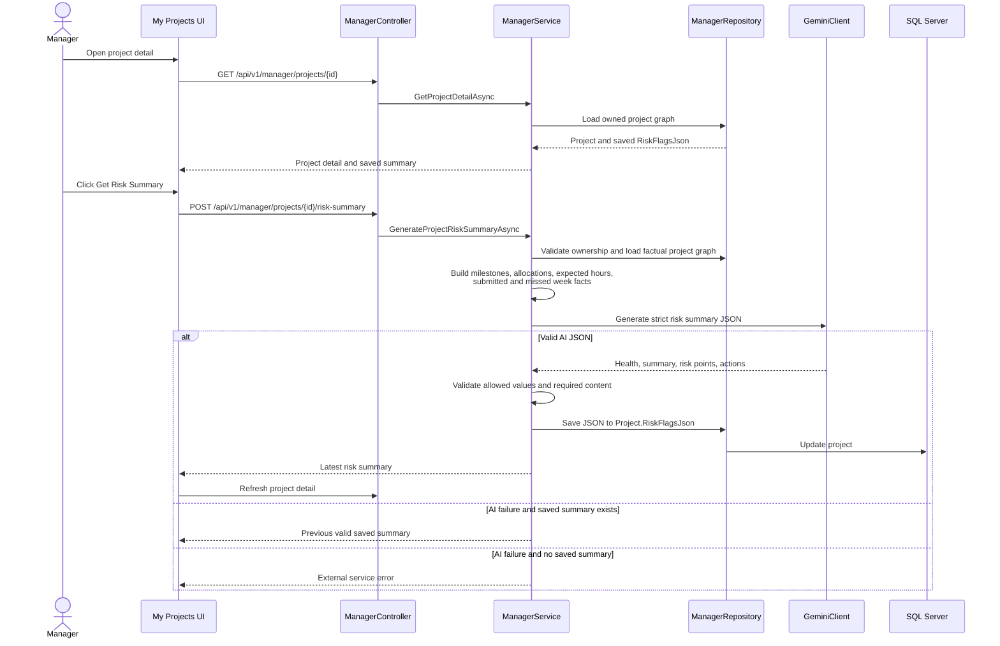
```mermaid
sequenceDiagram
    actor Manager
    participant UI as My Projects UI
    participant API as ManagerController
    participant Service as ManagerService
    participant Repo as ManagerRepository
    participant LLM as GeminiClient
    participant DB as SQL Server

    Manager->>UI: Open project detail
    UI->>API: GET /api/v1/manager/projects/{id}
    API->>Service: GetProjectDetailAsync
    Service->>Repo: Load owned project graph
    Repo-->>Service: Project and saved RiskFlagsJson
    Service-->>UI: Project detail and saved summary

    Manager->>UI: Click Get Risk Summary
    UI->>API: POST /api/v1/manager/projects/{id}/risk-summary
    API->>Service: GenerateProjectRiskSummaryAsync
    Service->>Repo: Validate ownership and load factual project graph
    Service->>Service: Build milestones, allocations, expected hours,<br/>submitted and missed week facts
    Service->>LLM: Generate strict risk summary JSON

    alt Valid AI JSON
        LLM-->>Service: Health, summary, risk points, actions
        Service->>Service: Validate allowed values and required content
        Service->>Repo: Save JSON to Project.RiskFlagsJson
        Repo->>DB: Update project
        Service-->>UI: Latest risk summary
        UI->>API: Refresh project detail
    else AI failure and saved summary exists
        Service-->>UI: Previous valid saved summary
    else AI failure and no saved summary
        Service-->>UI: External service error
    end
```

### Resource submits a weekly timesheet

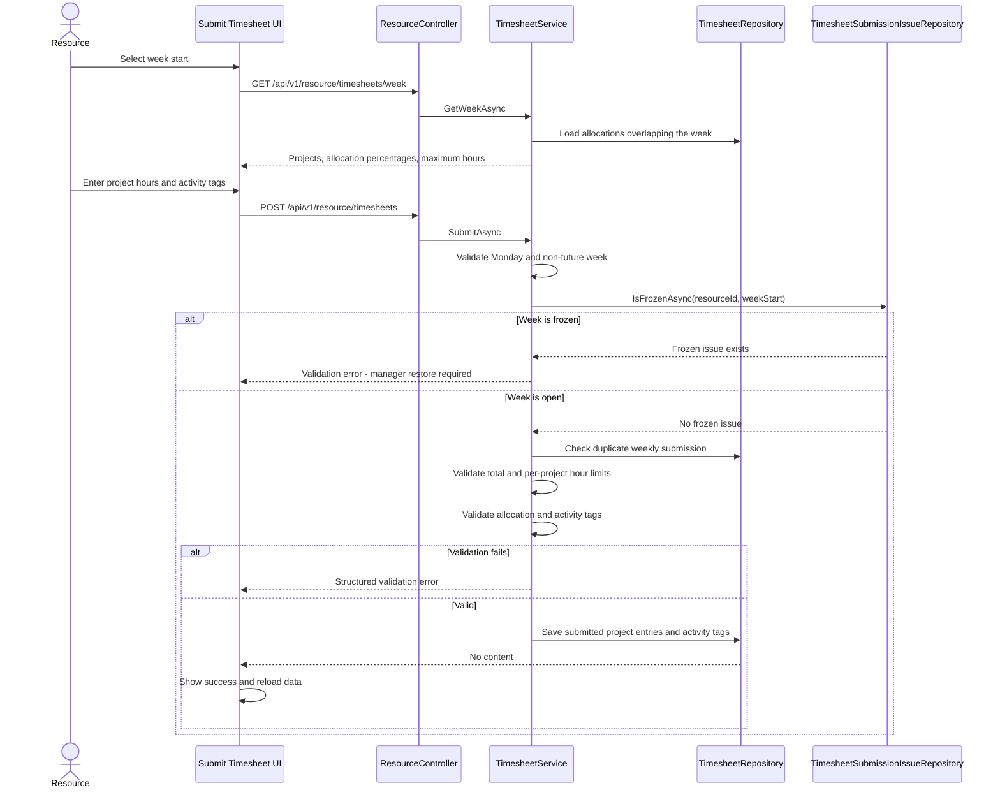
```mermaid
sequenceDiagram
    actor Resource
    participant UI as Submit Timesheet UI
    participant API as ResourceController
    participant Service as TimesheetService
    participant Repo as TimesheetRepository
    participant IssueRepo as TimesheetSubmissionIssueRepository

    Resource->>UI: Select week start
    UI->>API: GET /api/v1/resource/timesheets/week
    API->>Service: GetWeekAsync
    Service->>Repo: Load allocations overlapping the week
    Service-->>UI: Projects, allocation percentages, maximum hours
    Resource->>UI: Enter project hours and activity tags
    UI->>API: POST /api/v1/resource/timesheets
    API->>Service: SubmitAsync
    Service->>Service: Validate Monday and non-future week
    Service->>IssueRepo: IsFrozenAsync(resourceId, weekStart)
    alt Week is frozen
        IssueRepo-->>Service: Frozen issue exists
        Service-->>UI: Validation error - manager restore required
    else Week is open
        IssueRepo-->>Service: No frozen issue
    Service->>Repo: Check duplicate weekly submission
    Service->>Service: Validate total and per-project hour limits
    Service->>Service: Validate allocation and activity tags

        alt Validation fails
            Service-->>UI: Structured validation error
        else Valid
            Service->>Repo: Save submitted project entries and activity tags
            Repo-->>UI: No content
            UI->>UI: Show success and reload data
        end
    end
```

### Timesheet escalation scheduler sends reminders and freezes access

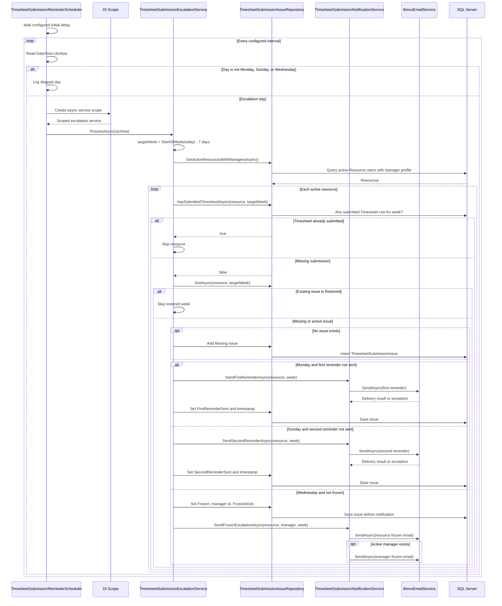
```mermaid
sequenceDiagram
    participant Scheduler as TimesheetSubmissionReminderScheduler
    participant Scope as DI Scope
    participant Service as TimesheetSubmissionEscalationService
    participant IssueRepo as TimesheetSubmissionIssueRepository
    participant Notify as TimesheetSubmissionNotificationService
    participant Email as BrevoEmailService
    participant DB as SQL Server

    Scheduler->>Scheduler: Wait configured initial delay
    loop Every configured interval
        Scheduler->>Scheduler: Read DateTime.UtcNow
        alt Day is not Monday, Sunday, or Wednesday
            Scheduler->>Scheduler: Log skipped day
        else Escalation day
            Scheduler->>Scope: Create async service scope
            Scope-->>Scheduler: Scoped escalation service
            Scheduler->>Service: ProcessAsync(utcNow)
            Service->>Service: targetWeek = StartOfWeek(today) - 7 days
            Service->>IssueRepo: GetActiveResourcesWithManagersAsync()
            IssueRepo->>DB: Query active Resource users with manager profile
            DB-->>IssueRepo: Resources

            loop Each active resource
                Service->>IssueRepo: HasSubmittedTimesheetAsync(resource, targetWeek)
                IssueRepo->>DB: Any submitted Timesheet row for week?
                alt Timesheet already submitted
                    IssueRepo-->>Service: true
                    Service->>Service: Skip resource
                else Missing submission
                    IssueRepo-->>Service: false
                    Service->>IssueRepo: GetAsync(resource, targetWeek)
                    alt Existing issue is Restored
                        Service->>Service: Skip restored week
                    else Missing or active issue
                        opt No issue exists
                            Service->>IssueRepo: Add Missing issue
                            IssueRepo->>DB: Insert TimesheetSubmissionIssue
                        end

                        alt Monday and first reminder not sent
                            Service->>Notify: SendFirstReminderAsync(resource, week)
                            Notify->>Email: SendAsync(first reminder)
                            Email-->>Notify: Delivery result or exception
                            Service->>IssueRepo: Set FirstReminderSent and timestamp
                            IssueRepo->>DB: Save issue
                        else Sunday and second reminder not sent
                            Service->>Notify: SendSecondReminderAsync(resource, week)
                            Notify->>Email: SendAsync(second reminder)
                            Email-->>Notify: Delivery result or exception
                            Service->>IssueRepo: Set SecondReminderSent and timestamp
                            IssueRepo->>DB: Save issue
                        else Wednesday and not frozen
                            Service->>IssueRepo: Set Frozen, manager id, FrozenAtUtc
                            IssueRepo->>DB: Save issue before notification
                            Service->>Notify: SendFrozenEscalationAsync(resource, manager, week)
                            Notify->>Email: SendAsync(resource frozen email)
                            opt Active manager exists
                                Notify->>Email: SendAsync(manager frozen email)
                            end
                        end
                    end
                end
            end
        end
    end
```

### Manager restores frozen timesheet access

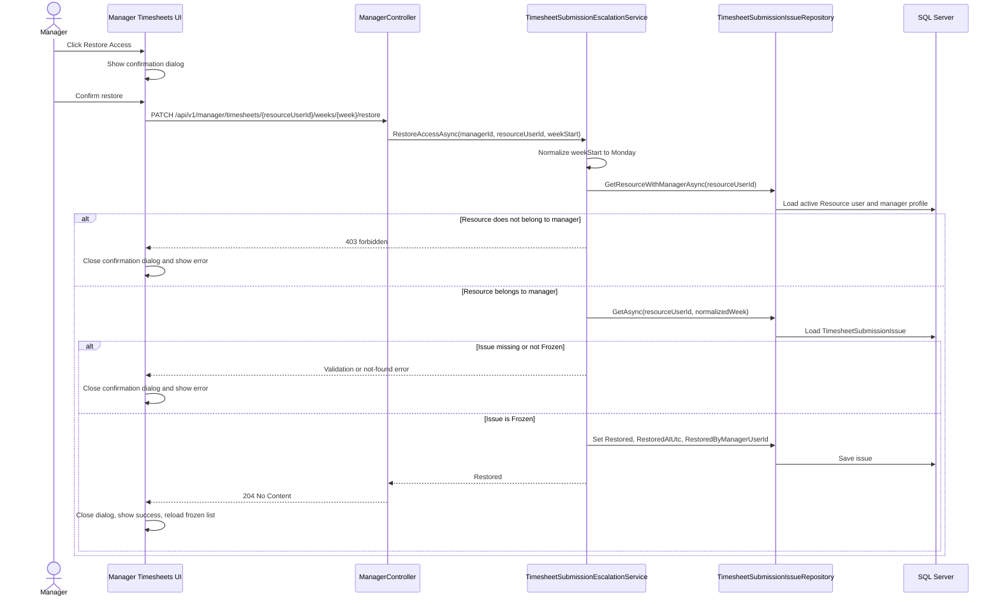
```mermaid
sequenceDiagram
    actor Manager
    participant UI as Manager Timesheets UI
    participant API as ManagerController
    participant Service as TimesheetSubmissionEscalationService
    participant IssueRepo as TimesheetSubmissionIssueRepository
    participant DB as SQL Server

    Manager->>UI: Click Restore Access
    UI->>UI: Show confirmation dialog
    Manager->>UI: Confirm restore
    UI->>API: PATCH /api/v1/manager/timesheets/{resourceUserId}/weeks/{week}/restore
    API->>Service: RestoreAccessAsync(managerId, resourceUserId, weekStart)
    Service->>Service: Normalize weekStart to Monday
    Service->>IssueRepo: GetResourceWithManagerAsync(resourceUserId)
    IssueRepo->>DB: Load active Resource user and manager profile

    alt Resource does not belong to manager
        Service-->>UI: 403 forbidden
        UI->>UI: Close confirmation dialog and show error
    else Resource belongs to manager
        Service->>IssueRepo: GetAsync(resourceUserId, normalizedWeek)
        IssueRepo->>DB: Load TimesheetSubmissionIssue
        alt Issue missing or not Frozen
            Service-->>UI: Validation or not-found error
            UI->>UI: Close confirmation dialog and show error
        else Issue is Frozen
            Service->>IssueRepo: Set Restored, RestoredAtUtc, RestoredByManagerUserId
            IssueRepo->>DB: Save issue
            Service-->>API: Restored
            API-->>UI: 204 No Content
            UI->>UI: Close dialog, show success, reload frozen list
        end
    end
```

### Scheduled project risk summary generation

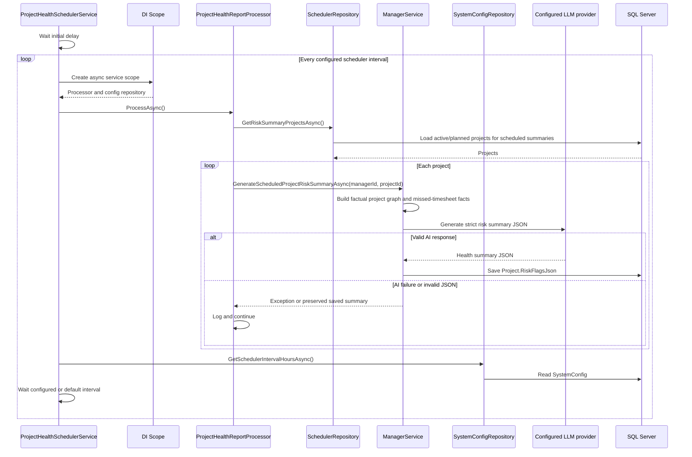
```mermaid
sequenceDiagram
    participant Scheduler as ProjectHealthSchedulerService
    participant Scope as DI Scope
    participant Processor as ProjectHealthReportProcessor
    participant SchedulerRepo as SchedulerRepository
    participant ManagerSvc as ManagerService
    participant ConfigRepo as SystemConfigRepository
    participant LLM as Configured LLM provider
    participant DB as SQL Server

    Scheduler->>Scheduler: Wait initial delay
    loop Every configured scheduler interval
        Scheduler->>Scope: Create async service scope
        Scope-->>Scheduler: Processor and config repository
        Scheduler->>Processor: ProcessAsync()
        Processor->>SchedulerRepo: GetRiskSummaryProjectsAsync()
        SchedulerRepo->>DB: Load active/planned projects for scheduled summaries
        DB-->>SchedulerRepo: Projects

        loop Each project
            Processor->>ManagerSvc: GenerateScheduledProjectRiskSummaryAsync(managerId, projectId)
            ManagerSvc->>ManagerSvc: Build factual project graph and missed-timesheet facts
            ManagerSvc->>LLM: Generate strict risk summary JSON
            alt Valid AI response
                LLM-->>ManagerSvc: Health summary JSON
                ManagerSvc->>DB: Save Project.RiskFlagsJson
            else AI failure or invalid JSON
                ManagerSvc-->>Processor: Exception or preserved saved summary
                Processor->>Processor: Log and continue
            end
        end

        Scheduler->>ConfigRepo: GetSchedulerIntervalHoursAsync()
        ConfigRepo->>DB: Read SystemConfig
        Scheduler->>Scheduler: Wait configured or default interval
    end
```

### Project health email scheduler sends unhealthy alerts

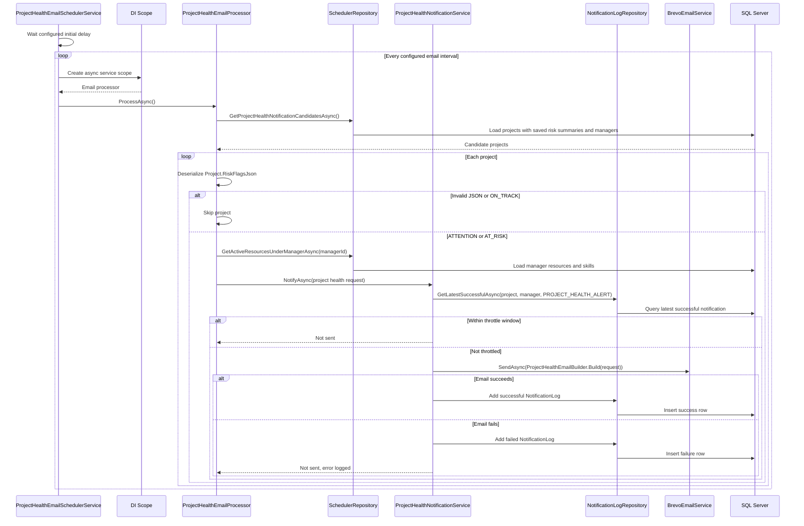
```mermaid
sequenceDiagram
    participant Scheduler as ProjectHealthEmailSchedulerService
    participant Scope as DI Scope
    participant Processor as ProjectHealthEmailProcessor
    participant SchedulerRepo as SchedulerRepository
    participant Notification as ProjectHealthNotificationService
    participant LogRepo as NotificationLogRepository
    participant Email as BrevoEmailService
    participant DB as SQL Server

    Scheduler->>Scheduler: Wait configured initial delay
    loop Every configured email interval
        Scheduler->>Scope: Create async service scope
        Scope-->>Scheduler: Email processor
        Scheduler->>Processor: ProcessAsync()
        Processor->>SchedulerRepo: GetProjectHealthNotificationCandidatesAsync()
        SchedulerRepo->>DB: Load projects with saved risk summaries and managers
        DB-->>Processor: Candidate projects

        loop Each project
            Processor->>Processor: Deserialize Project.RiskFlagsJson
            alt Invalid JSON or ON_TRACK
                Processor->>Processor: Skip project
            else ATTENTION or AT_RISK
                Processor->>SchedulerRepo: GetActiveResourcesUnderManagerAsync(managerId)
                SchedulerRepo->>DB: Load manager resources and skills
                Processor->>Notification: NotifyAsync(project health request)
                Notification->>LogRepo: GetLatestSuccessfulAsync(project, manager, PROJECT_HEALTH_ALERT)
                LogRepo->>DB: Query latest successful notification
                alt Within throttle window
                    Notification-->>Processor: Not sent
                else Not throttled
                    Notification->>Email: SendAsync(ProjectHealthEmailBuilder.Build(request))
                    alt Email succeeds
                        Notification->>LogRepo: Add successful NotificationLog
                        LogRepo->>DB: Insert success row
                    else Email fails
                        Notification->>LogRepo: Add failed NotificationLog
                        LogRepo->>DB: Insert failure row
                        Notification-->>Processor: Not sent, error logged
                    end
                end
            end
        end
    end
```

### Resource scheduler refreshes computed resource state

```mermaid
sequenceDiagram
    participant Scheduler as ResourceSchedulerService
    participant Scope as DI Scope
    participant Compute as SchedulerComputationService
    participant ConfigRepo as SystemConfigRepository
    participant SchedulerRepo as SchedulerRepository
    participant DB as SQL Server

    Scheduler->>Scheduler: Wait initial delay
    loop Every configured scheduler interval
        Scheduler->>Scope: Create async service scope
        Scope-->>Scheduler: Computation service and config repository
        Scheduler->>Compute: ExecuteAsync()
        Compute->>SchedulerRepo: Load resources and active allocations
        SchedulerRepo->>DB: Query allocation/resource facts
        DB-->>Compute: Facts for computation
        Compute->>Compute: Recalculate derived resource status facts
        Scheduler->>ConfigRepo: GetSchedulerIntervalHoursAsync()
        ConfigRepo->>DB: Read SystemConfig.SchedulerIntervalHours
        Scheduler->>Scheduler: Wait configured or default interval
    end
```

## Entity relationship diagram

```mermaid
erDiagram
    USER ||--o| RESOURCE_PROFILE : "has shared-key profile"
    USER ||--o{ RESOURCE_PROFILE : "manages"
    USER ||--o{ PROJECT : "owns"
    USER ||--o{ ALLOCATION : "receives"
    USER ||--o{ TIMESHEET : "submits"
    USER ||--o{ TIMESHEET_SUBMISSION_ISSUE : "has missing submission"
    USER ||--o{ TIMESHEET_SUBMISSION_ISSUE : "manages/restores"
    USER ||--o{ NOTIFICATION_LOG : "receives"
    RESOURCE_PROFILE ||--o{ SKILL : "has"
    PROJECT ||--o{ MILESTONE : "contains"
    PROJECT ||--o{ ALLOCATION : "staffs"
    PROJECT ||--o{ TIMESHEET : "records"
    PROJECT ||--o{ NOTIFICATION_LOG : "emits"
    TIMESHEET ||--o{ ACTIVITY_TAG : "contains"

    USER {
        uniqueidentifier Id PK
        string FullName
        string Email UK
        string Username UK
        string PasswordHash
        string Department
        string Designation
        string Role
        boolean IsActive
        boolean ForcePasswordChange
        datetime CreatedAt
        datetime UpdatedAt
    }

    RESOURCE_PROFILE {
        uniqueidentifier Id PK, FK
        uniqueidentifier ManagerId FK
    }

    SKILL {
        uniqueidentifier Id PK
        uniqueidentifier ResourceProfileId FK
        string SkillName
        string Category
        string Proficiency
        datetime AddedAt
    }

    PROJECT {
        uniqueidentifier Id PK
        uniqueidentifier ManagerId FK
        string Name
        string Description
        datetime StartDate
        datetime EndDate
        string Status
        string HealthStatus
        string RiskFlagsJson
        datetime CreatedAt
        datetime UpdatedAt
    }

    MILESTONE {
        uniqueidentifier Id PK
        uniqueidentifier ProjectId FK
        string Title
        datetime DueDate
        string Status
    }

    ALLOCATION {
        uniqueidentifier Id PK
        uniqueidentifier UserId FK
        uniqueidentifier ProjectId FK
        decimal UtilisationPercent
        datetime FromDate
        datetime ToDate
        boolean IsActive
        datetime CreatedAt
    }

    TIMESHEET {
        uniqueidentifier Id PK
        uniqueidentifier UserId FK
        uniqueidentifier ProjectId FK
        datetime WeekStartDate
        decimal HoursLogged
        string Status
        datetime SubmittedAt
    }

    ACTIVITY_TAG {
        uniqueidentifier Id PK
        uniqueidentifier TimesheetId FK
        string TagName
    }

    TIMESHEET_SUBMISSION_ISSUE {
        uniqueidentifier Id PK
        uniqueidentifier ResourceUserId FK
        uniqueidentifier ManagerUserId FK
        datetime WeekStartDate
        string Status
        datetime FirstReminderSentAtUtc
        datetime SecondReminderSentAtUtc
        datetime FrozenAtUtc
        datetime RestoredAtUtc
        uniqueidentifier RestoredByManagerUserId FK
        datetime CreatedAtUtc
        datetime UpdatedAtUtc
    }

    NOTIFICATION_LOG {
        uniqueidentifier Id PK
        uniqueidentifier ProjectId FK
        uniqueidentifier RecipientUserId FK
        string RecipientEmail
        string NotificationType
        datetime SentAtUtc
        boolean IsSuccess
        string FailureReason
    }

    SYSTEM_CONFIG {
        uniqueidentifier Id PK
        string LlmProvider
        string LlmApiKey
        int SchedulerIntervalHours
        decimal MaxWeeklyHours
    }
```

### Current enum values

| Enum | Values |
| --- | --- |
| Role | Admin, Manager, Resource |
| ResourceStatus | Bench, Allocated (computed from current allocations) |
| SkillCategory | Technical, Soft, Management, Domain |
| ProficiencyLevel | Beginner, Intermediate, Advanced, Expert |
| ProjectStatus | Planned, Active, Completed, OnHold, Cancelled |
| HealthStatus | Green, Amber, Red |
| MilestoneStatus | Pending, InProgress, Completed, Overdue |
| TimesheetStatus | Draft, Submitted, Approved, Rejected |
| TimesheetSubmissionIssueStatus | Missing, FirstReminderSent, SecondReminderSent, Frozen, Restored |

`Missed` is a calculated timesheet-history state. It is not persisted as a
`TimesheetStatus` value.

## Current API surface

All routes except login require JWT authentication.

### Authentication

| Method | Route | Access |
| --- | --- | --- |
| POST | `/api/v1/auth/login` | Anonymous |
| POST | `/api/v1/auth/change-password` | Authenticated |

### Admin users and employees

| Method | Route | Access |
| --- | --- | --- |
| GET, POST | `/api/v1/user` | Admin |
| GET | `/api/v1/user/active-managers` | Admin |
| POST | `/api/v1/user/reset-password/{id}` | Admin |
| PATCH | `/api/v1/user/{id}/deactivate` | Admin |
| PATCH | `/api/v1/user/{id}/reactivate` | Admin |
| GET | `/api/v1/admin/employees` | Admin |
| GET, POST | `/api/v1/admin/employees/{employeeId}/skills` | Admin |
| PATCH | `/api/v1/admin/employees/{employeeId}/skills/{skillId}/proficiency` | Admin |
| GET | `/api/v1/admin/employees/{employeeId}/manager-update-preview` | Admin |
| PATCH | `/api/v1/admin/employees/{employeeId}/manager` | Admin |

### Projects and allocations

| Method | Route | Access |
| --- | --- | --- |
| GET | `/api/v1/project` | Authenticated |
| POST | `/api/v1/project` | Admin |
| GET | `/api/v1/project/{projectId}/milestones` | Authenticated |
| POST | `/api/v1/project/{projectId}/milestones` | Admin |
| PUT | `/api/v1/project/{projectId}/milestones/{milestoneId}` | Admin |
| PATCH | `/api/v1/project/{projectId}/manager` | Admin |
| GET | `/api/v1/allocation` | Authenticated |

### Manager

| Method | Route | Access |
| --- | --- | --- |
| GET | `/api/v1/manager/resources` | Manager |
| GET | `/api/v1/manager/resources/{resourceId}` | Manager |
| POST | `/api/v1/manager/resources/find` | Manager |
| GET | `/api/v1/manager/projects` | Manager |
| GET | `/api/v1/manager/projects/{projectId}` | Manager |
| POST | `/api/v1/manager/projects/{projectId}/risk-summary` | Manager |
| POST | `/api/v1/manager/allocations` | Manager |
| PATCH | `/api/v1/manager/allocations/{allocationId}/end` | Manager |
| GET | `/api/v1/manager/timesheets` | Manager |
| GET | `/api/v1/manager/timesheets/frozen` | Manager |
| PATCH | `/api/v1/manager/timesheets/{resourceUserId}/weeks/{weekStartDate}/restore` | Manager |

### Resource self-service

| Method | Route | Access |
| --- | --- | --- |
| GET | `/api/v1/resource/allocations` | Resource |
| GET | `/api/v1/resource/timesheets/week` | Resource |
| POST | `/api/v1/resource/timesheets` | Resource |
| GET | `/api/v1/resource/timesheets` | Resource |
| GET | `/api/v1/resource/timesheets/{weekStartDate}` | Resource |

## Business rules

### User and resource lifecycle

- Email and username must be unique.
- User creation does not create a resource profile.
- A resource profile is created on demand when a manager is assigned
  or profile-specific data such as skills is added.
- Department and designation are nullable `User` fields but are required when
  creating Manager or Resource users.
- Admin users may leave department and designation blank.
- User creation accepts and hashes an explicit temporary password.
- `ResourceProfile.Id` is both its primary key and a foreign key to `User.Id`.
- A user can have at most one resource profile; no separate profile identity or
  `UserId` column exists.
- Active state and creation date come from the linked `User`.
- Bench or Allocated status is calculated from current allocations and is not
  stored in `ResourceProfile`.
- Deactivating a Resource sets `User.IsActive` to false, ends active
  allocations, and clears the resource profile manager assignment.
- A Manager cannot be deactivated while active/planned projects or active
  resources remain assigned.
- Reactivation does not restore manager assignments or allocations.

### Manager assignment

- Only Admin can update employee and project managers.
- The selected manager must be active and have the Manager role.
- Updating an employee manager ends all active allocations as of today.
- Updating a project manager is blocked when an allocated resource also belongs
  to another active project under the current manager.
- When a project manager update is allowed, the project and actively allocated
  resources move to the new manager in one transaction.

### Allocation

- Managers can access only their own projects and assigned Resource-role team
  members.
- Projects must be Active or Planned before allocation.
- `FromDate` must be before `ToDate`.
- Overlapping allocations cannot exceed 100 percent utilization.
- AI recommendations never bypass server-side allocation validation.

### Timesheets

- Resources can submit only for projects allocated during the selected week.
- Week start must be Monday and cannot be in the future.
- A weekly submission cannot be duplicated.
- Project hours cannot exceed allocation percentage multiplied by configured
  maximum weekly hours.
- Total weekly hours cannot exceed configured maximum weekly hours, default 40.
- Activity tags must come from the allowed catalog.
- Missed weeks are calculated from historical allocation coverage.
- Missed submission escalation checks active Resource users against the target
  week and ignores users who already have a submitted timesheet.
- The escalation scheduler runs on Monday, Sunday, and Wednesday UTC. Monday
  sends the first reminder, Sunday sends the second reminder, and Wednesday
  freezes access for the missed week.
- Frozen access is stored in `TimesheetSubmissionIssues` and blocks resource
  submission until the resource's current manager restores access.
- Frozen escalation emails are sent to the resource and, when available, the
  active manager. Frozen issue updates are saved before notification attempts.

### AI safety boundaries

- LLM providers never receive raw EF Core entities.
- Resource intent is normalized and validated before querying candidates.
- Candidate eligibility and backend score are deterministic.
- The second AI call can explain only supplied shortlisted resource IDs.
- Invalid or unavailable explanation output falls back to backend reasons.
- Project detail does not automatically call AI.
- Risk summary generation occurs only after the manager clicks the action.
- Invalid AI risk JSON never overwrites the last valid saved summary.
- Saved risk summaries are stored in `Project.RiskFlagsJson`.

## LLM provider configuration

`ManagerService` depends only on `ILlmClient`. `ConfiguredLlmClient` asks
`LlmClientFactory` for the provider selected by
`LLMProvider:ActiveProvider`. Provider clients share the existing prompt
builder and structured response contracts.

```json
{
  "LLMProvider": {
    "ActiveProvider": "Gemini",
    "Providers": {
      "Gemini": {
        "ApiKey": "YOUR_GEMINI_API_KEY",
        "Model": "gemini-2.5-flash"
      },
      "Gemma": {
        "ApiKey": "YOUR_GEMMA_API_KEY",
        "ApiKeyHeader": "Authorization",
        "ApiKeyScheme": "Bearer",
        "Endpoint": "http://164.52.211.238/api/generate",
        "Model": "gemma-3-27b-it"
      }
    }
  }
}
```

Set `ActiveProvider` to either `Gemini` or `Gemma`. Gemini uses Google's
Generative Language API. Gemma uses the independently configured
`http://164.52.211.238/api/generate` endpoint.

The Gemma client sends an Ollama-style request containing `model`, `prompt`,
`stream: false`, and `format: "json"`. It accepts either a response string in
the `response`, `generated_text`, or `text` property, or a direct JSON object.
Change `ApiKeyHeader` and `ApiKeyScheme` if the hosted endpoint uses a custom
authentication header. Leave `ApiKey` as a placeholder when the endpoint does
not require authentication.

To add another provider:

1. Implement `ILlmProviderClient`.
2. Give the client a unique `ProviderName`.
3. Register its typed HTTP client and `ILlmProviderClient` mapping.
4. Add its configuration and select it through `ActiveProvider`.

Application services and controllers do not need to change.

## Project health email notifications

The existing background scheduler generates and saves project risk summaries.
When a scheduled summary returns `ATTENTION` or `AT_RISK`, the notification
service sends a plain-English alert to the project manager through Brevo.
`ON_TRACK` projects do not generate email.

The email contains:

- Project health and summary
- Key risk points and potential impact
- Recommended manager actions
- Suggested skills or resource capabilities
- UTC generation time

Configure Brevo with a verified sender:

```json
{
  "Notifications": {
    "ProjectHealth": {
      "ThrottleHours": 24
    },
    "Brevo": {
      "ApiKey": "YOUR_BREVO_API_KEY",
      "SenderEmail": "YOUR_VERIFIED_SENDER_EMAIL",
      "SenderName": "ResourceMindAI"
    }
  }
}
```

Each delivery attempt is stored in `NotificationLogs`. Before sending, the
notification service checks the latest successful row for the same project,
recipient, and `PROJECT_HEALTH_ALERT` notification type. A successful email
within the configured throttle window blocks another email. Failed attempts
are recorded but do not throttle retries. Email failures do not stop the
scheduler from processing other projects.

## Automated backend tests

The backend test suite uses xUnit, FluentAssertions, Moq, and EF Core InMemory.
Application tests mock repositories and `ILlmClient`, so tests never call
Gemini, Gemma, or any other external service. Infrastructure tests use an isolated
database per test class.

Test projects:

- `backend/tests/ResourceMindAI.Application.Tests`
- `backend/tests/ResourceMindAI.Infrastructure.Tests`

Run every backend test from the `backend` directory:

```bash
dotnet test
```

Run one test project:

```bash
dotnet test tests/ResourceMindAI.Application.Tests/ResourceMindAI.Application.Tests.csproj
```

Show detailed test output:

```bash
dotnet test --logger "console;verbosity=detailed"
```

Collect OpenCover coverage:

```bash
dotnet test /p:CollectCoverage=true /p:CoverletOutputFormat=opencover
```

A successful run shows a non-zero test count and a passed summary. Failed tests
show the test name, assertion message, and stack trace. No AI API key or running
backend server is required.
