# ResourceMindAI

ResourceMindAI is a web-based project and resource management application for
Admin, Manager, and Employee users. It combines deterministic business rules
with Gemini-assisted resource matching and project risk summaries.

The solution uses:

- Angular with Kendo UI components and Signals
- ASP.NET Core Web API
- Entity Framework Core with SQL Server
- JWT bearer authentication
- Gemini structured JSON responses
- Global exception handling and role-based authorization

## Contents

1. [Architecture](#architecture)
2. [Authentication and authorization](#authentication-and-authorization)
3. [Class diagrams](#class-diagrams)
4. [Use case diagrams](#use-case-diagrams)
5. [Sequence diagrams](#sequence-diagrams)
6. [Entity relationship diagram](#entity-relationship-diagram)
7. [Current API surface](#current-api-surface)
8. [Business rules](#business-rules)
9. [Automated backend tests](#automated-backend-tests)

## Architecture

The existing layered structure is retained. Controllers are thin, application
services own validation and business rules, repositories own database queries,
and infrastructure contains EF Core and external integrations.

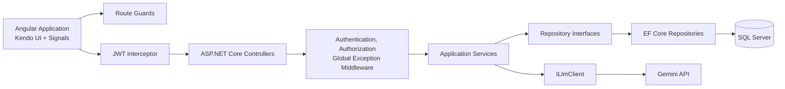

### Frontend modules

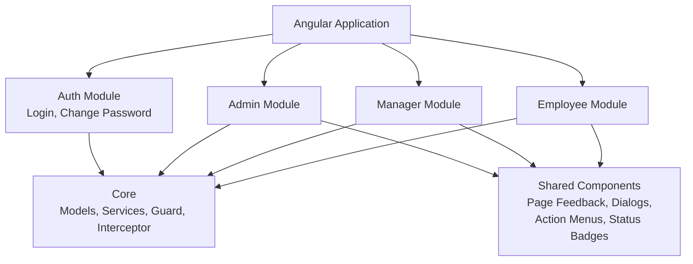

| Role | Active frontend routes |
| --- | --- |
| Admin | Dashboard, Users, Employees, Employee Detail, Projects, Milestones, Allocations, Configuration |
| Manager | Resource Dashboard, Allocate Resource, My Projects, Timesheets |
| Employee | My Allocations, Submit Timesheet, Timesheet History |

## Authentication and authorization

- Login returns a JWT and user profile.
- The Angular application stores the JWT in `sessionStorage`.
- The HTTP interceptor adds `Authorization: Bearer <token>` to API requests.
- Each browser tab has independent session storage, which supports testing
  different roles in separate tabs.
- Angular route guards provide navigation control.
- ASP.NET Core role authorization is the authoritative security boundary.
- JWT validation verifies issuer, audience, signature, expiration, and active
  user state.
- New users receive an initial password equal to their username and must change
  it after first login.

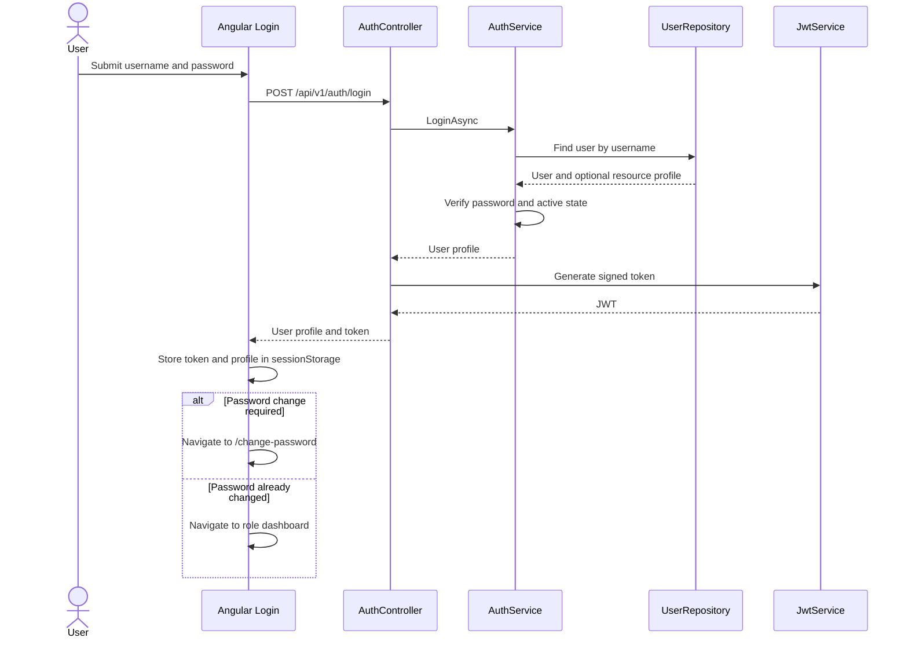

## Class diagrams

### Domain model

All primary keys and foreign keys use `Guid`.

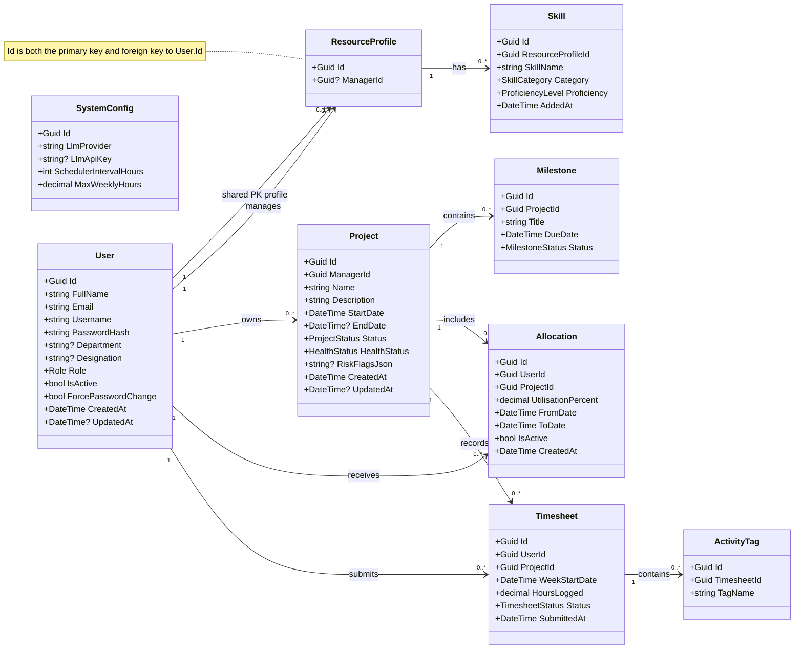

### Application and infrastructure services

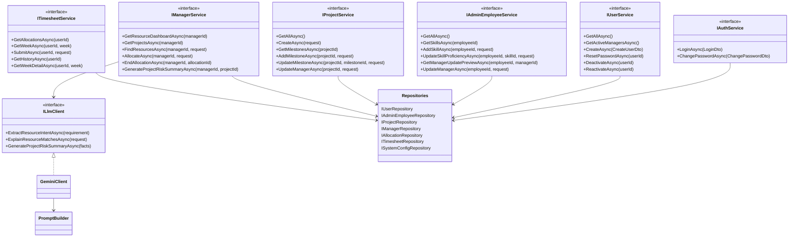

### Controller and authorization map

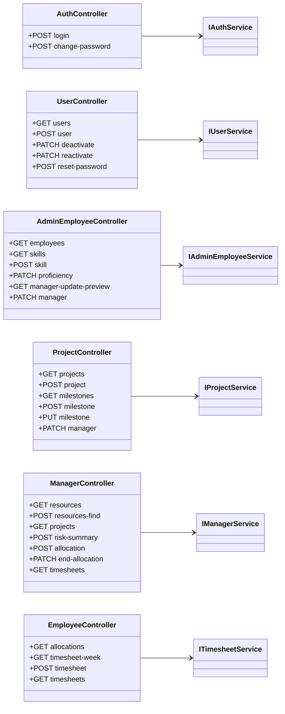

## Use case diagrams

Mermaid does not define a native UML use-case syntax, so the following diagrams
use flowcharts to represent actors and supported use cases.

### Role use cases

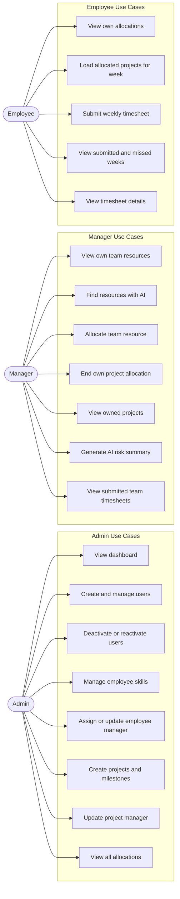

### Manager visibility boundary

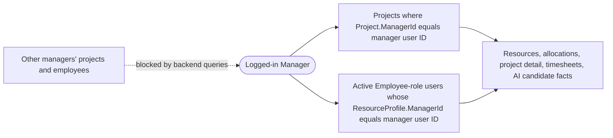

## Sequence diagrams

### Admin creates a user

User creation writes only the user account. Department, designation, role, and
active status belong to the user. A shared-key resource profile is created
later only when profile-specific data is required, such as employee manager
assignment or skills.

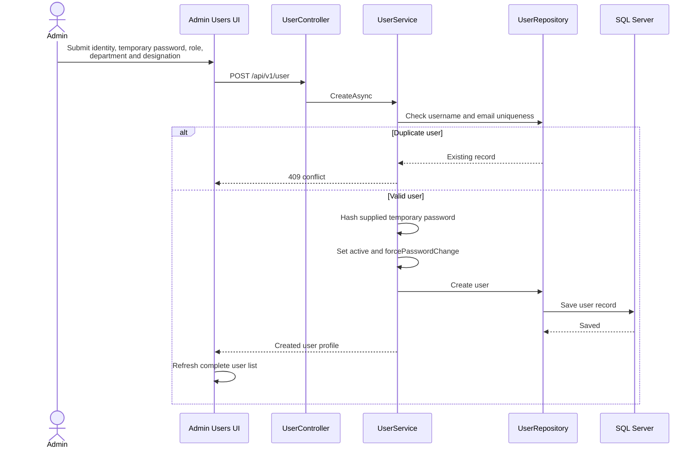

### Deactivate and reactivate user

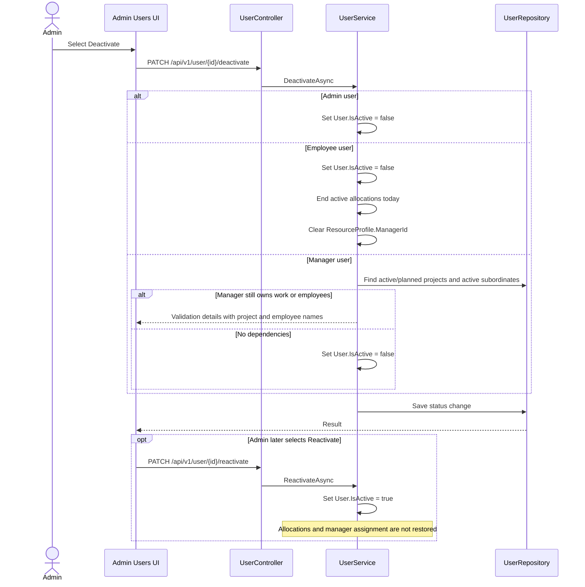

### Update employee manager


### Update project manager

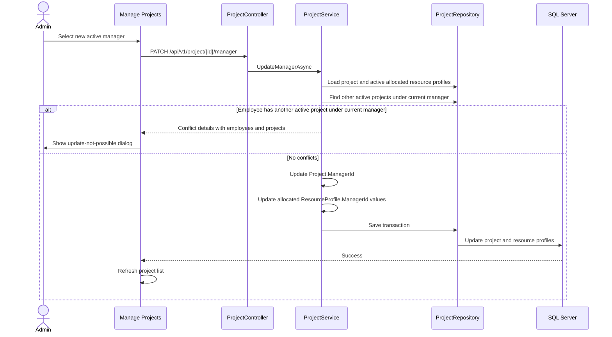

### AI-assisted resource search

Resource eligibility remains deterministic. Gemini extracts intent and explains
only the candidates already approved by backend rules.

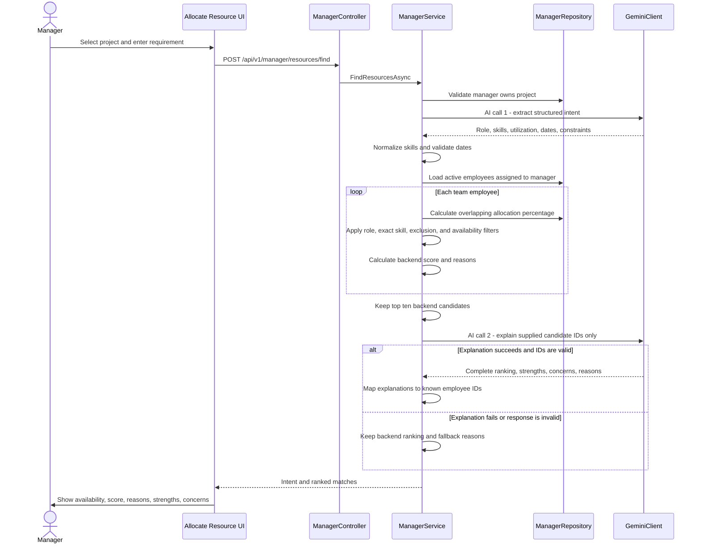

### Manager allocates or ends a resource allocation

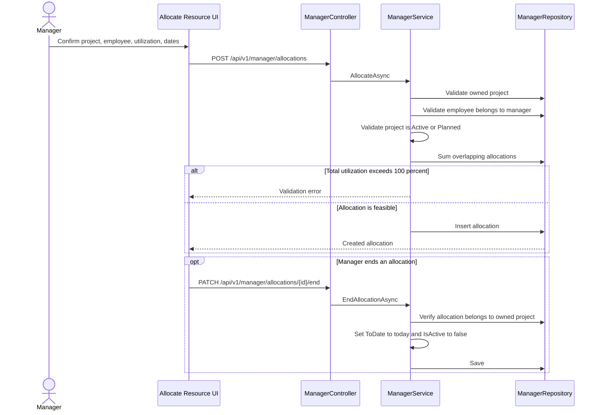

### On-demand AI project risk summary

Opening project detail never calls Gemini. It reads the last valid JSON saved in
`Project.RiskFlagsJson`.

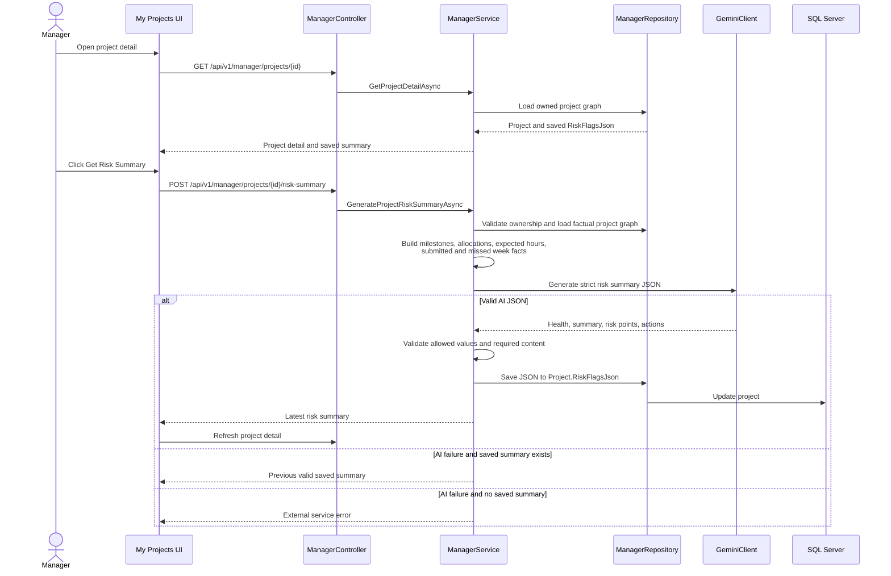

### Employee submits a weekly timesheet

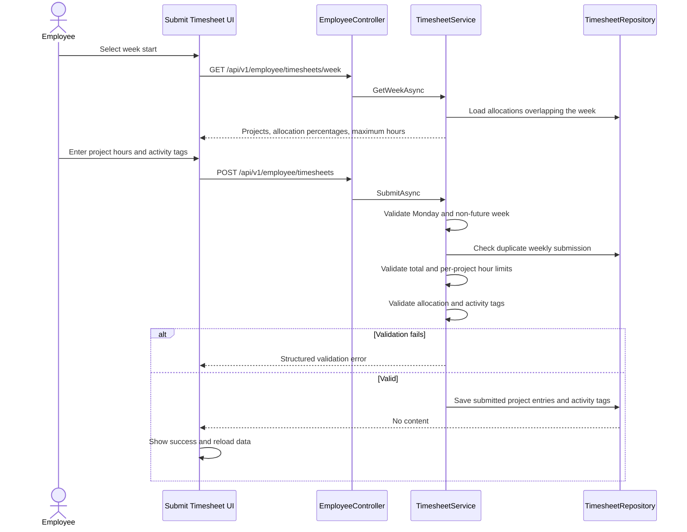

## Entity relationship diagram

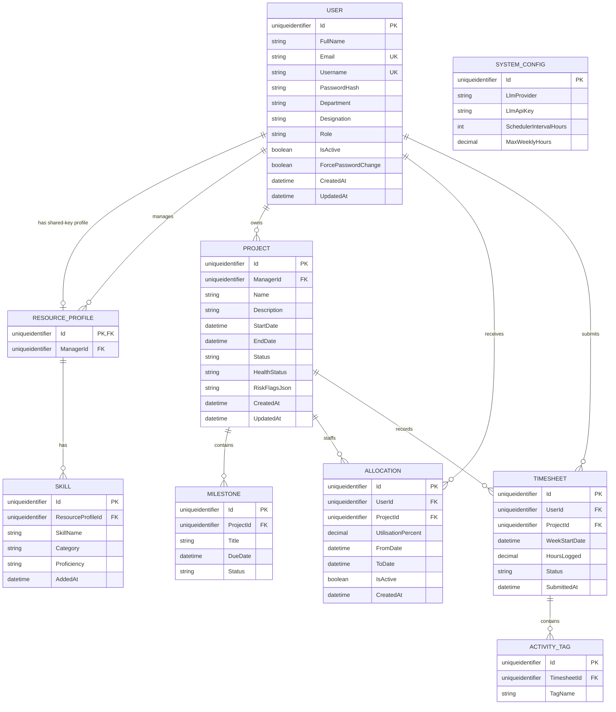

### Current enum values

| Enum | Values |
| --- | --- |
| Role | Admin, Manager, Employee |
| ResourceStatus | Bench, Allocated (computed from current allocations) |
| SkillCategory | Technical, Soft, Management, Domain |
| ProficiencyLevel | Beginner, Intermediate, Advanced, Expert |
| ProjectStatus | Planned, Active, Completed, OnHold, Cancelled |
| HealthStatus | Green, Amber, Red |
| MilestoneStatus | Pending, InProgress, Completed, Overdue |
| TimesheetStatus | Draft, Submitted, Approved, Rejected |

`Missed` is a calculated timesheet-history state. It is not persisted as a
`TimesheetStatus` value.

## Current API surface

All routes except login require JWT authentication.

### Authentication

| Method | Route | Access |
| --- | --- | --- |
| POST | `/api/v1/auth/login` | Anonymous |
| POST | `/api/v1/auth/change-password` | Authenticated |

### Admin users and employees

| Method | Route | Access |
| --- | --- | --- |
| GET, POST | `/api/v1/user` | Admin |
| GET | `/api/v1/user/active-managers` | Admin |
| POST | `/api/v1/user/reset-password/{id}` | Admin |
| PATCH | `/api/v1/user/{id}/deactivate` | Admin |
| PATCH | `/api/v1/user/{id}/reactivate` | Admin |
| GET | `/api/v1/admin/employees` | Admin |
| GET, POST | `/api/v1/admin/employees/{employeeId}/skills` | Admin |
| PATCH | `/api/v1/admin/employees/{employeeId}/skills/{skillId}/proficiency` | Admin |
| GET | `/api/v1/admin/employees/{employeeId}/manager-update-preview` | Admin |
| PATCH | `/api/v1/admin/employees/{employeeId}/manager` | Admin |

### Projects and allocations

| Method | Route | Access |
| --- | --- | --- |
| GET | `/api/v1/project` | Authenticated |
| POST | `/api/v1/project` | Admin |
| GET | `/api/v1/project/{projectId}/milestones` | Authenticated |
| POST | `/api/v1/project/{projectId}/milestones` | Admin |
| PUT | `/api/v1/project/{projectId}/milestones/{milestoneId}` | Admin |
| PATCH | `/api/v1/project/{projectId}/manager` | Admin |
| GET | `/api/v1/allocation` | Authenticated |

### Manager

| Method | Route | Access |
| --- | --- | --- |
| GET | `/api/v1/manager/resources` | Manager |
| GET | `/api/v1/manager/resources/{employeeId}` | Manager |
| POST | `/api/v1/manager/resources/find` | Manager |
| GET | `/api/v1/manager/projects` | Manager |
| GET | `/api/v1/manager/projects/{projectId}` | Manager |
| POST | `/api/v1/manager/projects/{projectId}/risk-summary` | Manager |
| POST | `/api/v1/manager/allocations` | Manager |
| PATCH | `/api/v1/manager/allocations/{allocationId}/end` | Manager |
| GET | `/api/v1/manager/timesheets` | Manager |

### Employee self-service

| Method | Route | Access |
| --- | --- | --- |
| GET | `/api/v1/employee/allocations` | Employee |
| GET | `/api/v1/employee/timesheets/week` | Employee |
| POST | `/api/v1/employee/timesheets` | Employee |
| GET | `/api/v1/employee/timesheets` | Employee |
| GET | `/api/v1/employee/timesheets/{weekStartDate}` | Employee |

## Business rules

### User and employee lifecycle

- Email and username must be unique.
- User creation does not create a resource profile.
- An employee resource profile is created on demand when a manager is assigned
  or profile-specific data such as skills is added.
- Department and designation are nullable `User` fields but are required when
  creating Manager or Employee users.
- Admin users may leave department and designation blank.
- User creation accepts and hashes an explicit temporary password.
- `ResourceProfile.Id` is both its primary key and a foreign key to `User.Id`.
- A user can have at most one resource profile; no separate profile identity or
  `UserId` column exists.
- Active state and creation date come from the linked `User`.
- Bench or Allocated status is calculated from current allocations and is not
  stored in `ResourceProfile`.
- Deactivating an Employee sets `User.IsActive` to false, ends active
  allocations, and clears the resource profile manager assignment.
- A Manager cannot be deactivated while active/planned projects or active
  employees remain assigned.
- Reactivation does not restore manager assignments or allocations.

### Manager assignment

- Only Admin can update employee and project managers.
- The selected manager must be active and have the Manager role.
- Updating an employee manager ends all active allocations as of today.
- Updating a project manager is blocked when an allocated employee also belongs
  to another active project under the current manager.
- When a project manager update is allowed, the project and actively allocated
  employees move to the new manager in one transaction.

### Allocation

- Managers can access only their own projects and assigned Employee-role team
  members.
- Projects must be Active or Planned before allocation.
- `FromDate` must be before `ToDate`.
- Overlapping allocations cannot exceed 100 percent utilization.
- AI recommendations never bypass server-side allocation validation.

### Timesheets

- Employees can submit only for projects allocated during the selected week.
- Week start must be Monday and cannot be in the future.
- A weekly submission cannot be duplicated.
- Project hours cannot exceed allocation percentage multiplied by configured
  maximum weekly hours.
- Total weekly hours cannot exceed configured maximum weekly hours, default 40.
- Activity tags must come from the allowed catalog.
- Missed weeks are calculated from historical allocation coverage.

### AI safety boundaries

- Gemini never receives raw EF Core entities.
- Resource intent is normalized and validated before querying candidates.
- Candidate eligibility and backend score are deterministic.
- The second AI call can explain only supplied shortlisted employee IDs.
- Invalid or unavailable explanation output falls back to backend reasons.
- Project detail does not automatically call AI.
- Risk summary generation occurs only after the manager clicks the action.
- Invalid AI risk JSON never overwrites the last valid saved summary.
- Saved risk summaries are stored in `Project.RiskFlagsJson`.

## Automated backend tests

The backend test suite uses xUnit, FluentAssertions, Moq, and EF Core InMemory.
Application tests mock repositories and `ILlmClient`, so tests never call
Gemini or any other external service. Infrastructure tests use an isolated
database per test class.

Test projects:

- `backend/tests/ResourceMindAI.Application.Tests`
- `backend/tests/ResourceMindAI.Infrastructure.Tests`

Run every backend test from the `backend` directory:

```bash
dotnet test
```

Run one test project:

```bash
dotnet test tests/ResourceMindAI.Application.Tests/ResourceMindAI.Application.Tests.csproj
```

Show detailed test output:

```bash
dotnet test --logger "console;verbosity=detailed"
```

Collect OpenCover coverage:

```bash
dotnet test /p:CollectCoverage=true /p:CoverletOutputFormat=opencover
```

A successful run shows a non-zero test count and a passed summary. Failed tests
show the test name, assertion message, and stack trace. No AI API key or running
backend server is required.
